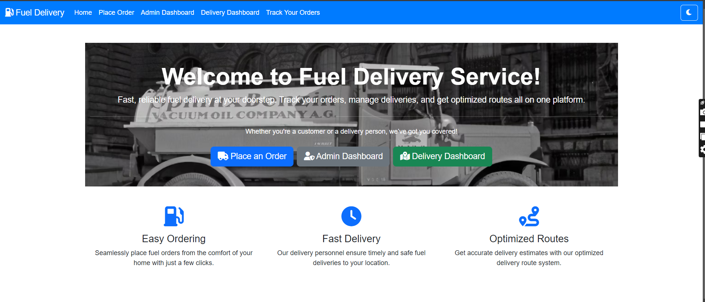
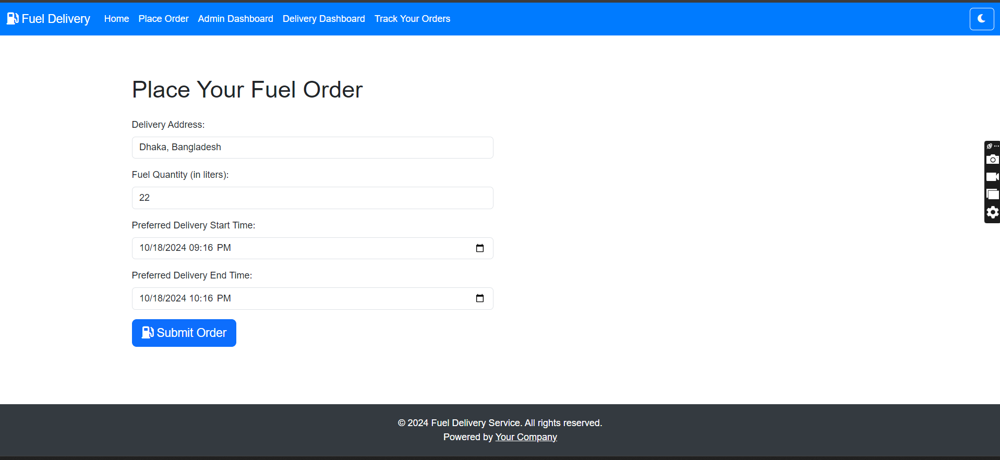
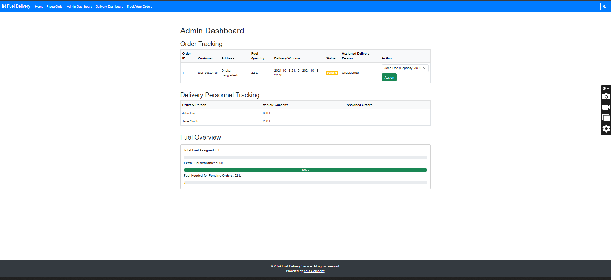
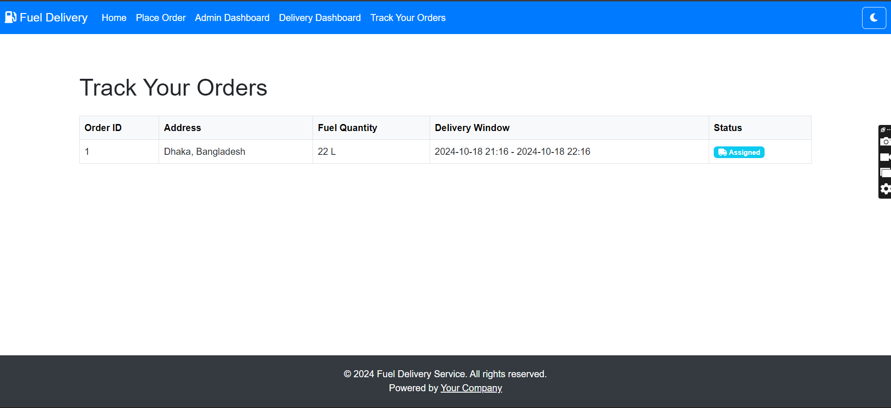
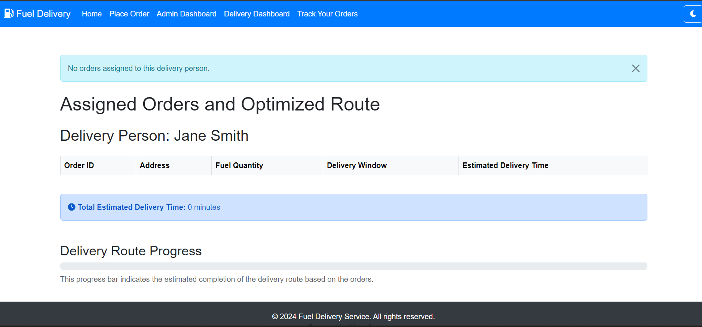
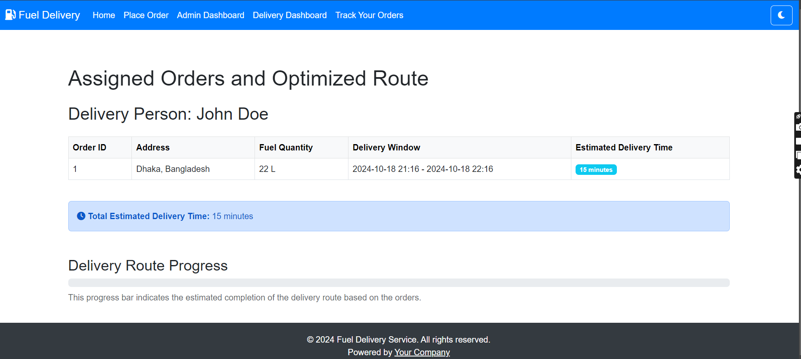

# Fuel Delivery App with TSP Optimization

This is a **Fuel Delivery Application** built with Flask, utilizing a **Traveling Salesman Problem (TSP)** algorithm to optimize delivery routes. The application allows customers to place fuel orders, administrators to assign deliveries, and delivery personnel to view their assigned orders and optimized routes.

## Features

- **Customer Order Placement**: Customers can place fuel delivery orders by specifying the delivery address, fuel quantity, and preferred delivery time window.
- **Order Tracking**: Customers can track the progress of their orders, including status updates on whether the order has been assigned or delivered.
- **Admin Dashboard**: Admins can view all orders, assign orders to available delivery personnel, track fuel availability, and oversee delivery progress.
- **Delivery Personnel Dashboard**: Delivery personnel can view their assigned orders, optimized delivery routes (using the TSP algorithm), and the estimated time to complete deliveries.
- **TSP Algorithm**: The system uses a simplified TSP optimization algorithm to generate the most efficient delivery route for assigned orders.

## Project Structure

```
Deliver-App-with-TSP/
├── app/
│   ├── __init__.py
│   ├── models.py
│   ├── routes.py
│   └── templates/
│       ├── base.html
│       ├── index.html
│       ├── customer_order.html
│       ├── admin_dashboard.html
│       ├── delivery_person_route.html
│       └── track_order.html
├── instance/
│   └── config.py
├── static/
├── .gitignore
├── requirements.txt
└── run.py
```

### Key Directories and Files

- **app/**: Contains the main application logic, including routes, models, and templates.
- **templates/**: HTML templates for rendering pages such as the admin dashboard, customer order form, delivery dashboard, and order tracking.
- **instance/**: Configuration files (such as environment-specific settings).
- **static/**: Static assets such as CSS, JavaScript, and images.
- **run.py**: The main entry point to run the Flask app.

## Installation and Setup

1. Clone the repository:
    ```
    git clone https://github.com/NoManNayeem/Deliver-App-with-TSP.git
    cd Deliver-App-with-TSP
    ```

2. Create a virtual environment and install dependencies:
    ```
    python3 -m venv venv
    source venv/bin/activate  # For Windows: venv\Scripts\activate
    pip install -r requirements.txt
    ```

3. Create an `.env` file in the root directory with your environment variables:
    ```
    FLASK_APP=run.py
    FLASK_ENV=development
    ```

4. Initialize the database:
    ```
    flask db init
    flask db migrate
    flask db upgrade
    ```

5. Run the Flask application:
    ```
    flask run
    ```

6. Open your browser and navigate to `http://127.0.0.1:5000/`.

## Usage

- **Customer**: Navigate to `/place-order` to place a new order.
- **Admin**: Navigate to `/admin` to manage orders, assign delivery personnel, and track fuel levels.
- **Delivery Personnel**: Navigate to `/delivery-person/<id>` to view assigned orders and optimized routes.


## Screenshots

Below are some screenshots from the application:

<div align="center">
  <table>
    <tr>
      <td>
        
      </td>
      <td>
        
      </td>
      <td>
        
      </td>
    </tr>
    <tr>
      <td>
        
      </td>
      <td>
        
      </td>
      <td>
        
      </td>
    </tr>
  </table>
</div>


For more details on the project structure, see [ProjectStructureObjective.md](./ProjectStructureObjective.md).


## Technologies Used

- **Flask**: Web framework for building the backend and APIs.
- **SQLite**: Database for storing orders, users, and delivery information.
- **Bootstrap**: Frontend framework for responsive and modern UI.
- **Google OR-Tools**: Used for solving the Traveling Salesman Problem (TSP) to optimize delivery routes.

## License

This project is licensed under the MIT License.
